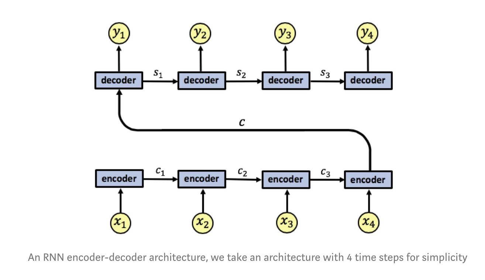
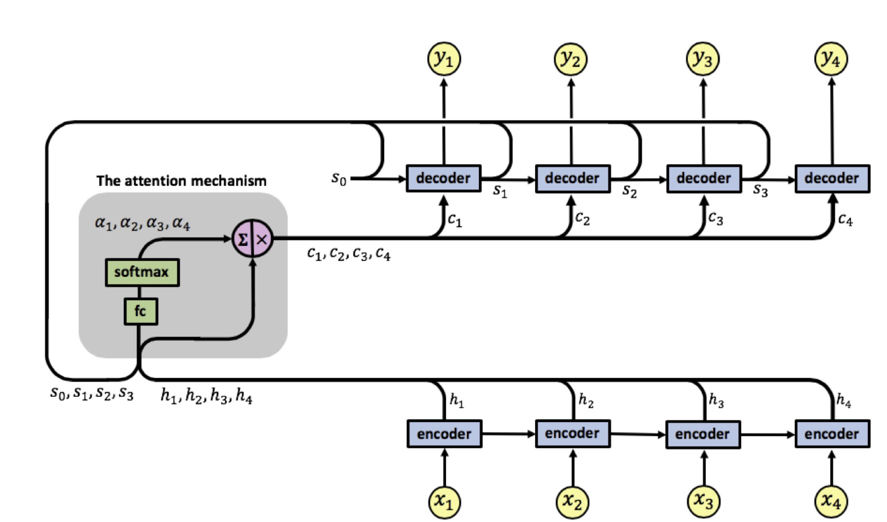

Note: repository in progress...

---

# Transliteration of Names

### Overview

This project focuses on transliterating names from English to Hindi using various sequence-to-sequence (seq2seq) models. The transliteration task involves converting the  **English** names into their equivalent in **Devanagari/Hindi** script.

---
### 1. Seq2Seq Models

A standard seq2seq model consists of two main components:

•	**Encoder**: Processes the input sequence $\mathbf{x} = (x_1, x_2 \dots x_N )$ and converts it into a **hidden** representation. This representation captures the meaning and structure of the input, which the model then uses to generate the output sequence.

•	**Decoder**: Takes the encoder’s representation as inputs and generates the output sequence $\mathbf{y} = (y_1, y_2 \dots y_N )$ step-by-step.

 - The decoder is modeling the distribution:
    $P(\mathbf{y}|\mathbf{x})=\quad P(y_1, y_2 \dots y_N|\mathbf{x}) = \quad \prod_{i=1}^{N} P(y_i|\mathbf{x}, y_{1:i-1})$

 
 

### 2. Seq2Seq Models with Attention

•	**Encoder**: Exactly similar to standard seq2seq

•	**Attention Mechanism**: For each decoding step, it computes attention weights $( \alpha_1, \alpha_2, \dots \alpha_N )$ for each encoder hidden state $( h_1, h_2, \dots h_N )$.

 - The attention weights are then applied to the encoder hidden states, producing a context vector ( c_j ) for each decoding step. This context vector is a weighted sum of encoder hidden states and dynamically focuses on different parts of the input sequence depending on the output being generated.

•	**Decoder**: 
	•	The decoder consists of multiple decoding steps. For each step, the decoder generates an output token  $y_1, y_2, \dots y_4$ (corresponding to each output time step).
	•	The decoder starts with an initial hidden state  $s_0$  and generates subsequent hidden states $( s_1, s_2 \dots s_N )$ based on the context vector from the attention mechanism and the previous decoder state.

---

